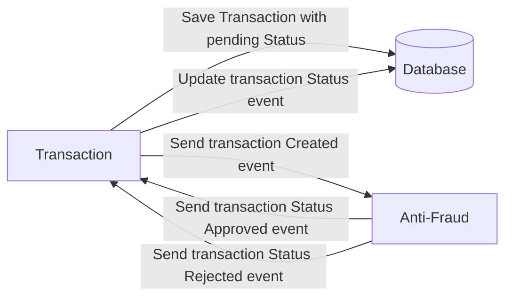
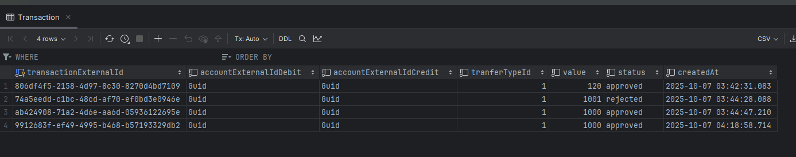

# Yape Code Challenge :rocket:

Our code challenge will let you marvel us with your Jedi coding skills :smile:. 

Don't forget that the proper way to submit your work is to fork the repo and create a PR :wink: ... have fun !!

- [Problem](#problem)
- [Tech Stack](#tech_stack)
- [Send us your challenge](#send_us_your_challenge)

# Problem

Every time a financial transaction is created it must be validated by our anti-fraud microservice and then the same service sends a message back to update the transaction status.
For now, we have only three transaction statuses:

<ol>
  <li>pending</li>
  <li>approved</li>
  <li>rejected</li>  
</ol>

Every transaction with a value greater than 1000 should be rejected.



# Tech Stack

<ol>
  <li>Node. You can use any framework you want (i.e. Nestjs with an ORM like TypeOrm or Prisma) </li>
  <li>Any database</li>
  <li>Kafka</li>    
</ol>

We do provide a `Dockerfile` to help you get started with a dev environment.

You must have two resources:

1. Resource to create a transaction that must containt:

```json
{
  "accountExternalIdDebit": "Guid",
  "accountExternalIdCredit": "Guid",
  "tranferTypeId": 1,
  "value": 120
}
```

2. Resource to retrieve a transaction

```json
{
  "transactionExternalId": "Guid",
  "transactionType": {
    "name": ""
  },
  "transactionStatus": {
    "name": ""
  },
  "value": 120,
  "createdAt": "Date"
}
```

## Optional

You can use any approach to store transaction data but you should consider that we may deal with high volume scenarios where we have a huge amount of writes and reads for the same data at the same time. How would you tackle this requirement?

You can use Graphql;

# Send us your challenge

When you finish your challenge, after forking a repository, you **must** open a pull request to our repository. There are no limitations to the implementation, you can follow the programming paradigm, modularization, and style that you feel is the most appropriate solution.

If you have any questions, please let us know.

## 🚀 How to run the infrastructure

**Prerequisites:**
- [Docker](https://www.docker.com/) and [Docker Compose](https://docs.docker.com/compose/) installed.

1. Clone the repository:
   ```bash
   git clone https://github.com/terreneitor4x4-hub/app-nodejs-codechallenge
   cd app-nodejs-codechallenge

2. Start the full stack (Postgres + Kafka + Zookeeper + microservices):
   ```bash
   docker compose up -d --build

3. Check logs:
   ```bash
   docker compose logs -f transaction-svc antifraud-svc


## 📡 Available Endpoints

### Create a transaction
**POST** `http://localhost:3000/transactions`

**Request:**
```json
{
  "accountExternalIdDebit": "Guid",
  "accountExternalIdCredit": "Guid",
  "tranferTypeId": 1,
  "value": 1000
}
```

**Response:**
```json
{
  "transactionExternalId": "ab424908-71a2-4d6e-aa6d-05936122695e",
  "accountExternalIdDebit": "Guid",
  "accountExternalIdCredit": "Guid",
  "tranferTypeId": 1,
  "value": 1000,
  "status": "pending",
  "createdAt": "2025-10-07T03:44:47.210Z"
}
```

### Get a transaction
**GET** `http://localhost:3000/transactions/{transactionExternalId}`

**Approved Response (value ≤ 1000):**
```json
{
  "transactionExternalId": "ab424908-71a2-4d6e-aa6d-05936122695e",
  "accountExternalIdDebit": "Guid",
  "accountExternalIdCredit": "Guid",
  "tranferTypeId": 1,
  "value": 1000,
  "status": "approved",
  "createdAt": "2025-10-07T03:44:47.210Z"
}
```

**Rejected Response (value > 1000):**
```json
{
  "transactionExternalId": "74a5eedd-c1bc-48cd-af70-ef0bd3e0946e",
  "accountExternalIdDebit": "Guid",
  "accountExternalIdCredit": "Guid",
  "tranferTypeId": 1,
  "value": 1001,
  "status": "rejected",
  "createdAt": "2025-10-07T03:44:28.088Z"
}
```

## 🗄️ Database Example

Here is a snapshot of the `Transaction` table after creating some transactions:


